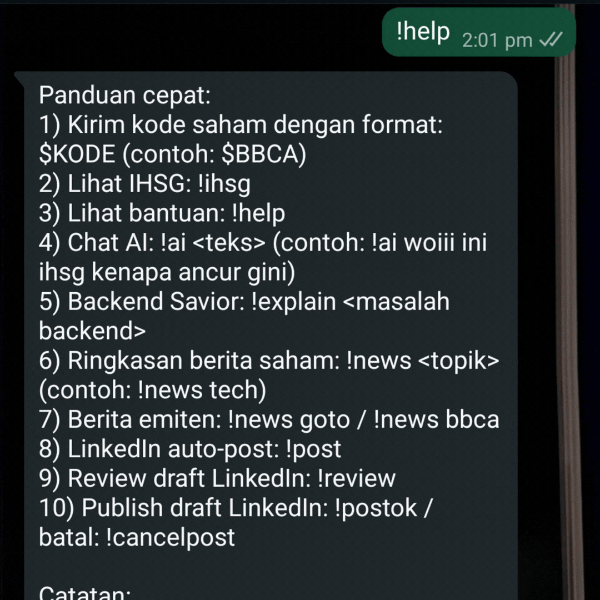
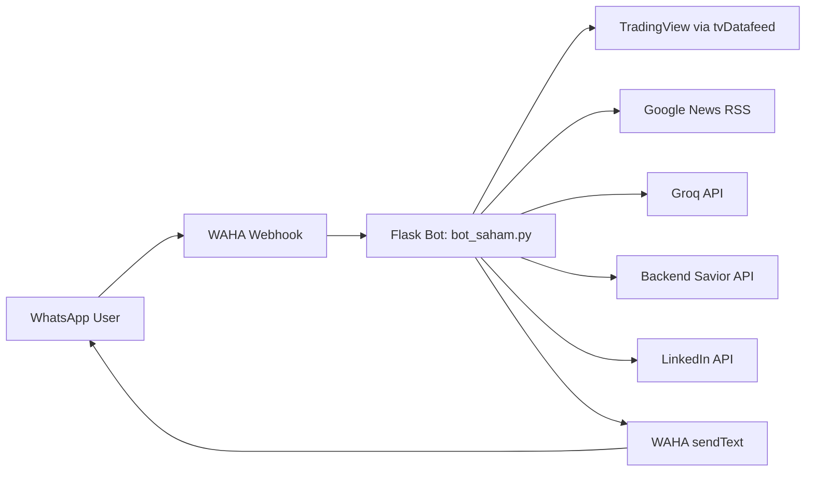
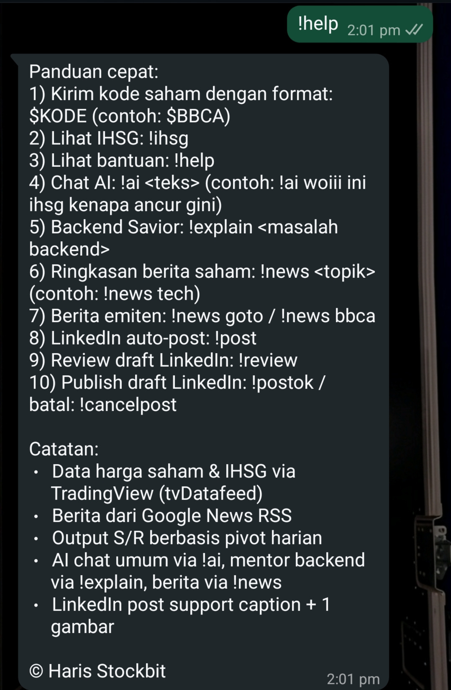
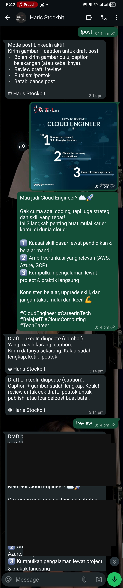
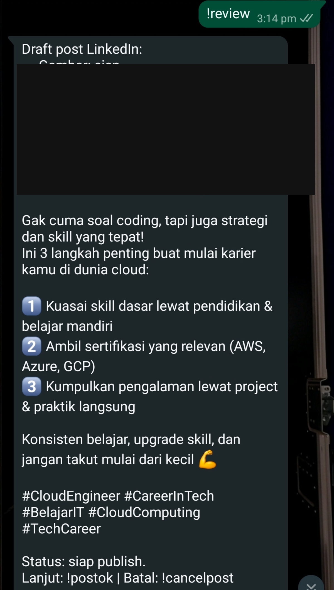
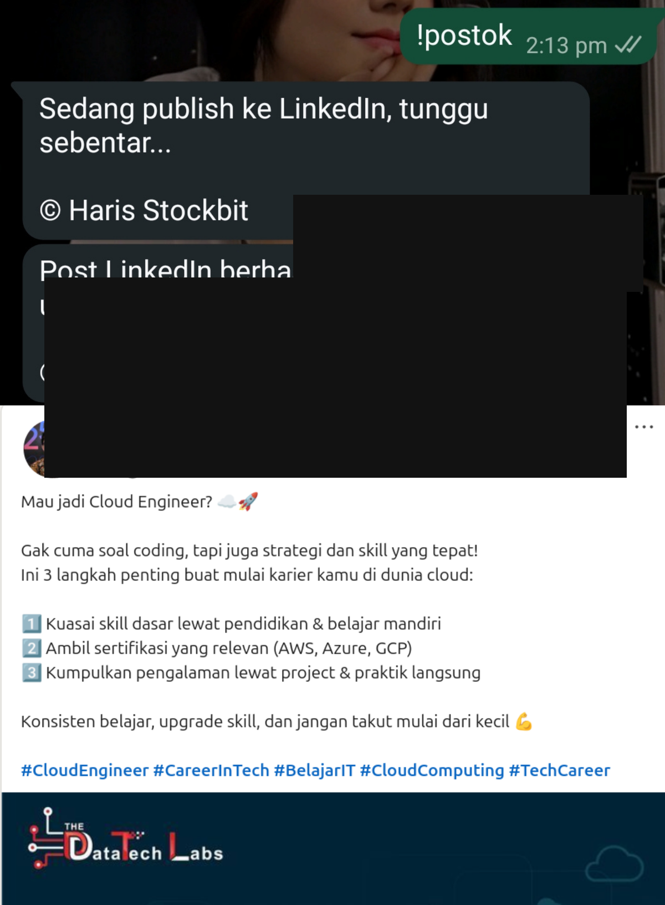
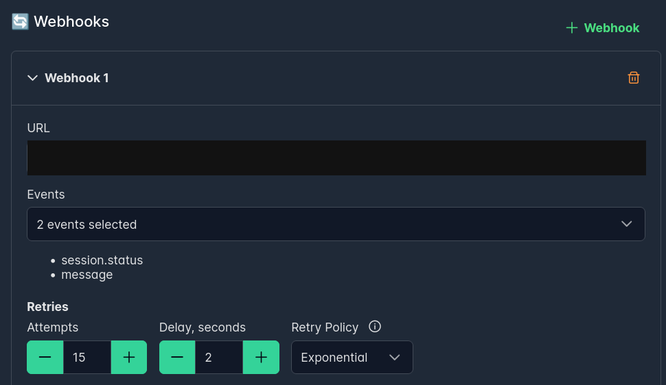

# Bot Saham WhatsApp (IDX) — AI + LinkedIn Auto Post


## TL;DR
- This project turns WhatsApp into a lightweight stock assistant for IDX quotes, market news summaries, and AI chat commands.
- It is built for users who want fast market context and social posting workflows without switching between multiple tools.
- It also supports a LinkedIn draft-to-publish flow (`!post` -> `!review` -> `!postok`) for quick content execution.

## Live Demo (Visual)
<p align="center">
  
</p>
*Short E2E demo of draft mode and publish path (`!post` -> input -> `!review` -> `!postok`).*

## Problem & Solution
**Problem**
- Stock checks, news tracking, and social posting are often fragmented across different apps.
- Manual copy-paste to publish content (for example to LinkedIn) adds friction and delays.

**Solution**
- A WhatsApp-first command bot that centralizes market lookup, AI-assisted context, and LinkedIn draft-based auto-posting in one flow.
- Users can gather signal and publish faster from chat, with fewer context switches.

## Key Features
- `$KODE` (example: `$BBCA`) -> IDX quote + support/resistance snapshot
- `!ihsg` -> IHSG index check
- `!news <topic>` -> latest news aggregation + AI summary
- `!ai <text>` -> general AI chat response
- `!explain <text>` -> backend mentor assistant mode
- `!post` -> start LinkedIn draft mode
- `!review` -> review current LinkedIn draft before posting
- `!postok` -> publish draft to LinkedIn
- `!cancelpost` -> cancel current draft session

## Architecture


Core components:
- **Ingress**: WAHA sends chat events to `/webhook`
- **Orchestrator**: Flask bot parses commands, applies rate-limit/session logic, and routes to services
- **Market Data**: TradingView (`tvDatafeed`) for IDX quote and IHSG
- **Content + AI**: Google News RSS + Groq summary/chat + backend mentor mode
- **Social Distribution**: LinkedIn image post pipeline (draft, review, publish)

## End-to-End Flows
### Flow A — Stock / News Query
1. User sends `$KODE`, `!ihsg`, or `!news <topic>` in WhatsApp.
2. WAHA forwards message payload to Flask webhook.
3. Bot routes command to TradingView or news+AI pipeline.
4. Bot formats response and sends result back via WAHA.

### Flow B — LinkedIn Draft Posting
1. User sends `!post` to activate draft mode.
2. User sends image and caption (single or separate messages).
3. User sends `!review` to inspect draft readiness.
4. User sends `!postok` to publish to LinkedIn (`!cancelpost` to abort).
5. Bot confirms success/failure and closes draft session.

## Screenshots

<p align="center">
  
</p>
*Command overview in WhatsApp conversation context.*

<p align="center">
  
</p>
*User sends media + caption while draft mode is active.*

<p align="center">
  
</p>
*`!review` shows draft status before publish.*

<p align="center">
  
</p>
*Bot confirms successful publishing result after `!postok`.*

<p align="center">
  
</p>
*Webhook configuration page in WAHA dashboard.*

## Quick Start
### 1) Setup Bot
```bash
cd ~/Documents/bot_saham2
python -m venv .venv
source .venv/bin/activate
pip install -r requirements.txt
cp .env.example .env
python bot_saham.py
```

### 2) Run WAHA
```bash
docker run -d --name backend-waha-1 -p 3000:3000 devlikeapro/waha:latest
```
Then open: `http://localhost:3000/dashboard`

### 3) Configure Webhook
Set WAHA webhook URL to one of:
- `http://host.docker.internal:5000/webhook`
- `http://172.17.0.1:5000/webhook`

### 4) Quick Local Simulation
```bash
python scripts/simulate_webhook.py --text '$BBCA'
python scripts/simulate_webhook.py --text '!news tech'
python scripts/simulate_webhook.py --text '!post'
python scripts/simulate_webhook.py --text 'Draft caption test' --media-url 'https://example.com/image.jpg' --media-mimetype 'image/jpeg'
python scripts/simulate_webhook.py --text '!review'
python scripts/simulate_webhook.py --text '!postok'
```

## Environment Variables
### WAHA
| Variable | Default | Description |
|---|---|---|
| `WAHA_BASE_URL` | `http://localhost:3000` | WAHA API base URL |
| `WAHA_SESSION` | `default` | WAHA session name |
| `WAHA_API_KEY` | - | WAHA API key (if enabled) |

### Runtime
| Variable | Default | Description |
|---|---|---|
| `PORT` | `5000` | Flask app port |
| `LOG_LEVEL` | `INFO` | Logging level |
| `CACHE_TTL_SECONDS` | `60` | Cache TTL |
| `RATE_LIMIT_SECONDS` | `5` | Per-chat rate-limit window |
| `NEWS_MAX_ITEMS` | `5` | Max news items per query |

### Market Data (TradingView)
| Variable | Default | Description |
|---|---|---|
| `TRADINGVIEW_USERNAME` | - | TradingView username (optional) |
| `TRADINGVIEW_PASSWORD` | - | TradingView password (optional) |
| `TV_INTERVAL` | `1d` | Quote interval (`1m/5m/15m/1h/1d`) |
| `TV_BARS` | `2` | Number of bars for quote calculation |
| `IHSG_SYMBOL` | `COMPOSITE` | IHSG symbol in TradingView |

### AI and News
| Variable | Default | Description |
|---|---|---|
| `GROQ_API_KEY` | - | API key for `!ai` and news summarization |
| `GROQ_MODEL` | `groq/compound-mini` | Groq model |
| `GROQ_API_URL` | `https://api.groq.com/openai/v1/chat/completions` | Groq endpoint |
| `BACKEND_SAVIOR_API_KEY` | - | API key for `!explain` |
| `BACKEND_SAVIOR_BASE_URL` | `https://integrate.api.nvidia.com/v1` | Backend mentor provider base URL |
| `BACKEND_SAVIOR_MODEL` | `z-ai/glm5` | Backend mentor model |
| `BACKEND_SAVIOR_DEBUG` | `true` | Show technical error details |
| `BACKEND_SAVIOR_MAX_TOKENS` | `700` | Max output tokens |
| `BACKEND_SAVIOR_TIMEOUT_CONNECT` | `10` | Connect timeout (seconds) |
| `BACKEND_SAVIOR_TIMEOUT_READ` | `45` | Read timeout (seconds) |
| `BACKEND_SAVIOR_RETRIES` | `2` | Retry count |
| `BACKEND_SAVIOR_RETRY_BACKOFF_SECONDS` | `1.2` | Exponential backoff base |

### LinkedIn Posting
| Variable | Default | Description |
|---|---|---|
| `LINKEDIN_ACCESS_TOKEN` | - | OAuth access token |
| `LINKEDIN_AUTHOR_URN` | - | Author URN, example `urn:li:person:xxxx` |
| `LINKEDIN_API_BASE_URL` | `https://api.linkedin.com` | LinkedIn API base URL |
| `LINKEDIN_TIMEOUT_CONNECT` | `10` | Connect timeout (seconds) |
| `LINKEDIN_TIMEOUT_READ` | `45` | Read timeout (seconds) |
| `POST_SESSION_TTL_SECONDS` | `900` | Draft session TTL per chat |
| `LINKEDIN_CAPTION_MAX_CHARS` | `3000` | Caption character limit |

## Deployment (Private Server)
Recommended workflow for your current setup (update on laptop, deploy on private server):

### Laptop (build and push)
```bash
docker build -t <registry>/bot-saham:<tag> .
docker push <registry>/bot-saham:<tag>
```

### Private server (pull and recreate bot)
```bash
docker compose pull bot
docker compose up -d --no-deps --force-recreate bot
```

Notes:
- If bot and WAHA run in the same Docker Compose network, use `WAHA_BASE_URL=http://waha:3000`.
- `localhost` only works when bot runs directly on host (non-container) and WAHA is exposed on host port 3000.

## Troubleshooting
- **WAHA media fetch fails during `!postok`**:
  - Verify `WAHA_BASE_URL` from inside bot container is reachable (for compose: `http://waha:3000`).
- **LinkedIn auth errors (`invalid_client`, `unauthorized_scope_error`)**:
  - Rotate secret if exposed, verify redirect URI exact match, and request proper scopes.
- **No response for a command**:
  - Confirm webhook event type is `message` or `message.any` and session status is `WORKING`.
- **Draft not found**:
  - Draft state is in-memory; restarting bot resets active draft sessions.

## Author
**Syauqi Naufal**  
Backend-focused builder working on chat automation, market tooling, and API integrations.

- GitHub: [github.com/Syauqi-N](https://github.com/Syauqi-N)
- LinkedIn: [linkedin.com](https://www.linkedin.com/in/syauqi-naufal/)

## License
MIT
