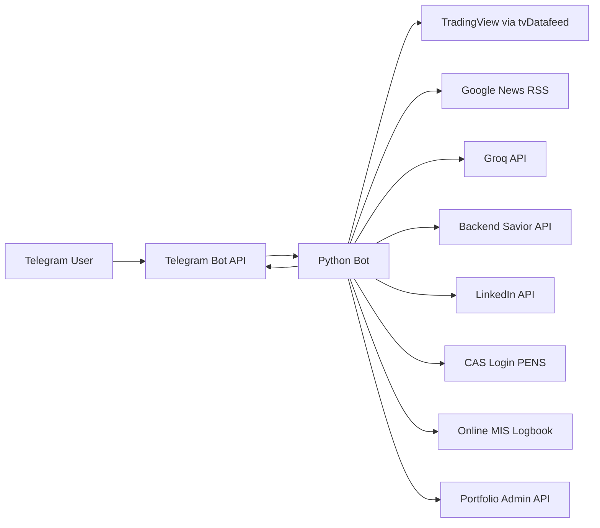

# Bot Saham Telegram

Telegram-first automation bot for IDX market lookup, AI assistance, LinkedIn posting, MIS logbook submission, and portfolio CRUD.


## Summary

- Full Telegram long polling bot, no WAHA, no webhook HTTP ingress.
- Private chat only. Group, supergroup, channel, and bot messages are ignored.
- Stateful workflows are built into the bot:
  - `!post` for LinkedIn image post drafts
  - `!logbook` for MIS logbook submission
  - `!porto` for portfolio CRUD via protected admin API

## What It Handles

### Market and AI
- `$KODE` for IDX stock quote with support/resistance
- `!ihsg` for IHSG overview
- `!news <topic>` for news aggregation plus AI summary
- `!ai <text>` for general AI chat
- `!explain <backend problem>` for backend mentor mode

### LinkedIn Draft Workflow
- `!post` starts a draft
- Send caption and up to 3 images in private chat
- `!review` previews the active draft
- `!postok` publishes the draft to LinkedIn
- `!cancelpost` drops the draft

### MIS Logbook Workflow
- `!logbook` starts a session
- Send material/activity text
- `!ok` submits the draft to MIS
- After submit, upload optional PDF or JPG/JPEG evidence
- `!skip` finishes without file upload
- `!update` changes the material before submit
- `!cancel` cancels the active logbook session

### Portfolio CRUD Workflow
- `!porto` starts a guided wizard
- Supports:
  - list projects
  - add project
  - edit project
  - delete project
  - edit profile
  - edit social links
- Common in-session commands:
  - `menu`
  - `back`
  - `save`
  - `cancel`
  - `exit`

## Architecture



Core pieces:
- `bot_saham.py` orchestrates command parsing, rate limiting, Telegram polling, and stateful sessions.
- `news_client.py` handles source fetch and filtering for `!news`.
- `linkedin_client.py` handles media upload and UGC post creation.
- `mis_logbook_client.py` handles CAS login, form submit, and optional file upload.
- Portfolio operations call a separate website admin API with `X-Portfolio-Secret`.

## Commands

| Command | Purpose |
|---|---|
| `$BBCA` | Quote saham IDX + support/resistance |
| `!ihsg` | Ringkasan IHSG |
| `!help` | Bantuan singkat |
| `!news tech` | Berita + AI summary |
| `!ai ...` | Chat AI umum |
| `!explain ...` | Mode mentor backend |
| `!post` | Mulai draft LinkedIn |
| `!review` | Review draft LinkedIn |
| `!postok` | Publish draft LinkedIn |
| `!cancelpost` | Batalkan draft LinkedIn |
| `!logbook` | Mulai sesi logbook |
| `!ok` | Submit logbook |
| `!update` | Update materi logbook |
| `!skip` | Lewati upload bukti logbook |
| `!cancel` | Batalkan sesi logbook aktif |
| `!porto` | Buka wizard CRUD portfolio |

## `!porto` Wizard

Main menu:

```txt
!porto

1. Lihat projects
2. Tambah project
3. Edit project
4. Hapus project
5. Edit profile
6. Edit social links
0. Keluar
```

Example add-project flow:

```txt
!porto
2
New Project
new-project
Short summary
2
yes
Python, Telegram Bot API
Deskripsi project
save
```

The bot keeps the session state per chat and guides the user step by step instead of relying on raw one-line commands.

## Setup

### 1. Create environment

```bash
cd ~/Documents/bot_saham2
python3 -m venv .venv
source .venv/bin/activate
pip install -r requirements.txt
cp .env.example .env
```

### 2. Create Telegram bot

1. Open `@BotFather`
2. Run `/newbot`
3. Copy the token into `TELEGRAM_BOT_TOKEN`
4. Run `/setjoingroups` and choose `Disable`

### 3. Run locally

```bash
python3 bot_saham.py
```

Or with Docker:

```bash
docker compose up --build -d
```

## Quick Check

DM the bot in Telegram and try:

- `$BBCA`
- `!news tech`
- `!ai why is IHSG weak today?`
- `!post`
- `!logbook`
- `!porto`

## Environment Variables

### Telegram
| Variable | Default | Description |
|---|---|---|
| `TELEGRAM_BOT_TOKEN` | - | Bot token from `@BotFather` |
| `TELEGRAM_API_BASE_URL` | `https://api.telegram.org` | Telegram Bot API base URL |
| `TELEGRAM_POLL_TIMEOUT_SECONDS` | `30` | `getUpdates` long polling timeout |
| `TELEGRAM_DROP_PENDING_UPDATES` | `true` | Drop pending updates on startup |

### Market Data
| Variable | Default | Description |
|---|---|---|
| `TRADINGVIEW_USERNAME` | - | TradingView username, optional |
| `TRADINGVIEW_PASSWORD` | - | TradingView password, optional |
| `TV_INTERVAL` | `1d` | Quote interval |
| `TV_BARS` | `2` | Bars used for quote calculation |
| `IHSG_SYMBOL` | `COMPOSITE` | Symbol for IHSG |

### AI and News
| Variable | Default | Description |
|---|---|---|
| `GROQ_API_KEY` | - | Required for `!ai` and `!news` summary |
| `GROQ_MODEL` | `groq/compound-mini` | Groq model |
| `GROQ_API_URL` | `https://api.groq.com/openai/v1/chat/completions` | Groq endpoint |
| `BACKEND_SAVIOR_API_KEY` | - | Required for `!explain` |
| `BACKEND_SAVIOR_BASE_URL` | `https://integrate.api.nvidia.com/v1` | Backend mentor provider base URL |
| `BACKEND_SAVIOR_MODEL` | `z-ai/glm5` | Backend mentor model |
| `BACKEND_SAVIOR_DEBUG` | `true` | Show technical error details |
| `BACKEND_SAVIOR_MAX_TOKENS` | `700` | Max output tokens |
| `BACKEND_SAVIOR_TIMEOUT_CONNECT` | `10` | Connect timeout |
| `BACKEND_SAVIOR_TIMEOUT_READ` | `45` | Read timeout |
| `BACKEND_SAVIOR_RETRIES` | `2` | Retry count |
| `BACKEND_SAVIOR_RETRY_BACKOFF_SECONDS` | `1.2` | Retry backoff base |
| `BACKEND_SAVIOR_FALLBACK_TO_GROQ` | `true` | Use Groq fallback for retryable failures |
| `BACKEND_SAVIOR_FALLBACK_MAX_TOKENS` | `450` | Max tokens for fallback |
| `NEWS_MAX_ITEMS` | `5` | Max items per `!news` request |
| `NEWS_HTTP_TIMEOUT` | `8` | Timeout per source request |
| `NEWS_RELAX_DAYS` | `7` | Relaxed day range if strict search is empty |
| `NEWS_PER_SOURCE_MULTIPLIER` | `3` | Fetch multiplier before dedupe |
| `NEWS_SITE_SOURCES` | `cnbcindonesia.com,...` | Google site search source list |
| `NEWS_DIRECT_FEEDS` | `https://www.antaranews.com/rss/ekonomi.xml` | Additional direct RSS feeds |

### LinkedIn
| Variable | Default | Description |
|---|---|---|
| `LINKEDIN_ACCESS_TOKEN` | - | Required for LinkedIn publishing |
| `LINKEDIN_AUTHOR_URN` | - | LinkedIn author URN |
| `LINKEDIN_ALLOWED_CHAT_IDS` | - | Optional allowlist for `!post` |
| `LINKEDIN_API_BASE_URL` | `https://api.linkedin.com` | LinkedIn API base URL |
| `LINKEDIN_TIMEOUT_CONNECT` | `10` | Connect timeout |
| `LINKEDIN_TIMEOUT_READ` | `45` | Read timeout |
| `POST_SESSION_TTL_SECONDS` | `900` | Draft TTL per chat |
| `LINKEDIN_CAPTION_MAX_CHARS` | `3000` | Max caption length |
| `LINKEDIN_MAX_IMAGES` | `3` | Max image count per post |

### MIS Logbook
| Variable | Default | Description |
|---|---|---|
| `LOGBOOK_ENABLED` | `true` | Enable logbook flow |
| `LOGBOOK_ALLOWED_CHAT_IDS` | - | Required allowlist for `!logbook` |
| `LOGBOOK_CAS_LOGIN_URL` | MIS CAS URL | CAS login URL |
| `LOGBOOK_FORM_URL` | MIS form URL | MIS logbook form URL |
| `LOGBOOK_CAS_USERNAME` | - | CAS username |
| `LOGBOOK_CAS_PASSWORD` | - | CAS password |
| `LOGBOOK_DEFAULT_START_TIME` | `08:00` | Default start time |
| `LOGBOOK_DEFAULT_END_TIME` | `17:00` | Default end time |
| `LOGBOOK_DEFAULT_RELATED` | `true` | Default related-course checkbox |
| `LOGBOOK_DEFAULT_COURSE_KEYWORD` | `RI042106` | Default course keyword |
| `LOGBOOK_DEFAULT_CHECKBOX` | `true` | Default agreement checkbox |
| `LOGBOOK_TIMEOUT_CONNECT` | `10` | Connect timeout |
| `LOGBOOK_TIMEOUT_READ` | `45` | Read timeout |
| `LOGBOOK_MATERIAL_MAX_CHARS` | `4000` | Max material length |

### Portfolio API
| Variable | Default | Description |
|---|---|---|
| `PORTFOLIO_API_BASE_URL` | - | Portfolio website base URL |
| `PORTFOLIO_API_SECRET` | - | Shared secret for protected admin API |
| `PORTFOLIO_ALLOWED_CHAT_IDS` | - | Required allowlist for `!porto` |

### Runtime
| Variable | Default | Description |
|---|---|---|
| `LOG_LEVEL` | `INFO` | Log level |
| `CACHE_TTL_SECONDS` | `60` | Quote/news cache TTL |
| `RATE_LIMIT_SECONDS` | `5` | Per-chat rate limit window |

## Runtime Notes

- The bot calls `deleteWebhook` on startup and then uses `getUpdates`.
- Telegram media is fetched through `getFile`, downloaded, and converted to base64 in memory.
- Startup fails fast if required config is missing:
  - always: `TELEGRAM_BOT_TOKEN`, `LINKEDIN_ACCESS_TOKEN`, `LINKEDIN_AUTHOR_URN`
  - if `LOGBOOK_ENABLED=true`: `LOGBOOK_CAS_LOGIN_URL`, `LOGBOOK_FORM_URL`, `LOGBOOK_CAS_USERNAME`, `LOGBOOK_CAS_PASSWORD`
  - if `PORTFOLIO_API_BASE_URL` is set: `PORTFOLIO_API_SECRET`
- `!post`, `!logbook`, and `!porto` are stateful. The bot rejects overlapping flows in the same chat.

## Troubleshooting

- **Bot does not respond in Telegram**
  - Check `TELEGRAM_BOT_TOKEN`
  - Make sure the bot is running
  - Make sure you are sending messages in private chat, not a group

- **`!post` is rejected**
  - Check `LINKEDIN_ALLOWED_CHAT_IDS`
  - Check LinkedIn token and author URN

- **`!logbook` fails or is rejected**
  - Check `LOGBOOK_ALLOWED_CHAT_IDS`
  - Check CAS login URL, form URL, username, and password

- **`!porto` fails or is rejected**
  - Check `PORTFOLIO_ALLOWED_CHAT_IDS`
  - Check `PORTFOLIO_API_BASE_URL`
  - Check `PORTFOLIO_API_SECRET`

- **Logbook upload fails**
  - Send PDF or JPG/JPEG only
  - Upload after `!ok`, or use `!skip`

- **News or AI result is empty**
  - Check `GROQ_API_KEY`
  - Check news source reachability and timeout settings
