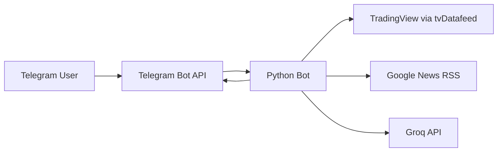

# Bot Saham Telegram Public

Public-facing Telegram bot for IDX market lookup, news summaries, and lightweight AI assistance.


## Summary

- Full Telegram long polling bot, no WAHA and no inbound webhook server.
- Public feature set only:
  - `$KODE` for IDX quotes
  - `!ihsg`
  - `!news <topic>`
  - `!ai <text>`
  - `!help`
- Private operational workflows have been moved out of this public codebase into the separate private bot repository.

## Commands

| Command | Purpose |
|---|---|
| `$BBCA` | IDX quote plus support/resistance |
| `!ihsg` | IHSG summary |
| `!news tech` | News aggregation and AI summary |
| `!ai why is IHSG weak today?` | General AI chat |
| `!help` | Quick command guide |

## Architecture



Core pieces:
- `bot_saham.py` handles Telegram polling, command parsing, caching, and rate limiting.
- `news_client.py` fetches and filters sources for `!news`.
- `ai_router.py` handles Groq-based chat and summarization.

## Setup

### 1. Create environment

```bash
cd ~/Documents/bot_saham2
python3 -m venv .venv
source .venv/bin/activate
pip install -r requirements.txt
cp .env.example .env
```

### 2. Create Telegram bot

1. Open `@BotFather`
2. Run `/newbot`
3. Copy the token into `TELEGRAM_BOT_TOKEN`
4. Run `/setjoingroups` and choose `Disable`

### 3. Run locally

```bash
python3 bot_saham.py
```

Or with Docker:

```bash
docker compose up --build -d
```

## Quick Check

DM the bot and try:

- `$BBCA`
- `!ihsg`
- `!news tech`
- `!ai what moved the market today?`
- `!help`

## Environment Variables

### Telegram
| Variable | Default | Description |
|---|---|---|
| `TELEGRAM_BOT_TOKEN` | - | Bot token from `@BotFather` |
| `TELEGRAM_API_BASE_URL` | `https://api.telegram.org` | Telegram Bot API base URL |
| `TELEGRAM_POLL_TIMEOUT_SECONDS` | `30` | `getUpdates` long polling timeout |
| `TELEGRAM_DROP_PENDING_UPDATES` | `true` | Drop pending updates on startup |

### Market Data
| Variable | Default | Description |
|---|---|---|
| `TRADINGVIEW_USERNAME` | - | TradingView username, optional |
| `TRADINGVIEW_PASSWORD` | - | TradingView password, optional |
| `TV_INTERVAL` | `1d` | Quote interval |
| `TV_BARS` | `2` | Bars used for quote calculation |
| `IHSG_SYMBOL` | `COMPOSITE` | Symbol for IHSG |

### AI and News
| Variable | Default | Description |
|---|---|---|
| `GROQ_API_KEY` | - | Required for `!ai` and `!news` summary |
| `GROQ_MODEL` | `groq/compound-mini` | Groq model |
| `GROQ_API_URL` | `https://api.groq.com/openai/v1/chat/completions` | Groq endpoint |
| `NEWS_MAX_ITEMS` | `5` | Max items per `!news` request |
| `NEWS_HTTP_TIMEOUT` | `8` | Timeout per source request |
| `NEWS_RELAX_DAYS` | `7` | Relaxed day range if strict search is empty |
| `NEWS_PER_SOURCE_MULTIPLIER` | `3` | Fetch multiplier before dedupe |
| `NEWS_SITE_SOURCES` | `cnbcindonesia.com,kontan.co.id,bisnis.com,idxchannel.com` | Google site search source list |
| `NEWS_DIRECT_FEEDS` | `https://www.antaranews.com/rss/ekonomi.xml` | Additional direct RSS feeds |

### Runtime
| Variable | Default | Description |
|---|---|---|
| `LOG_LEVEL` | `INFO` | Log level |
| `CACHE_TTL_SECONDS` | `60` | Quote and news cache TTL |
| `RATE_LIMIT_SECONDS` | `5` | Per-chat rate limit window |

## Runtime Notes

- The bot deletes any existing webhook on startup and then uses `getUpdates`.
- Private chat only. Group, supergroup, channel, and bot messages are ignored.
- Startup fails fast only when `TELEGRAM_BOT_TOKEN` is missing.

## Related Private Bot

Private operational workflows such as LinkedIn posting, MIS logbook automation, portfolio CRUD, and personal admin flows have been moved to the separate private codebase at:

```txt
/home/soqisoqi/Documents/bot_soqi
```
